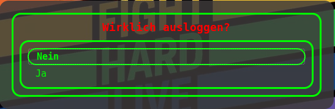

## Chaosbengel's patch repository

This repository contains patches that I created to taylor available Software
to my needs. 

I give my best to commit back to the original reposiories. As soon as a patch is
merged to the upstream project, I'll remove it from this repo.

## Patches

### wofi\_1.5.1\_add\_title

This patch adds a `-T/--title` option to wofi so it can be used do make
dialog menus just like this:

You can style it with `#title` in the CSS file.

Upstream project: <https://hg.sr.ht/~scoopta/wofi>  
Upstream commit: <https://lists.sr.ht/~scoopta/wofi/patches/62618>

## How to apply patches

- Clone source project in the stated version
- Apply with `patch -p1 -d project_directory < project_version_name.patch`
